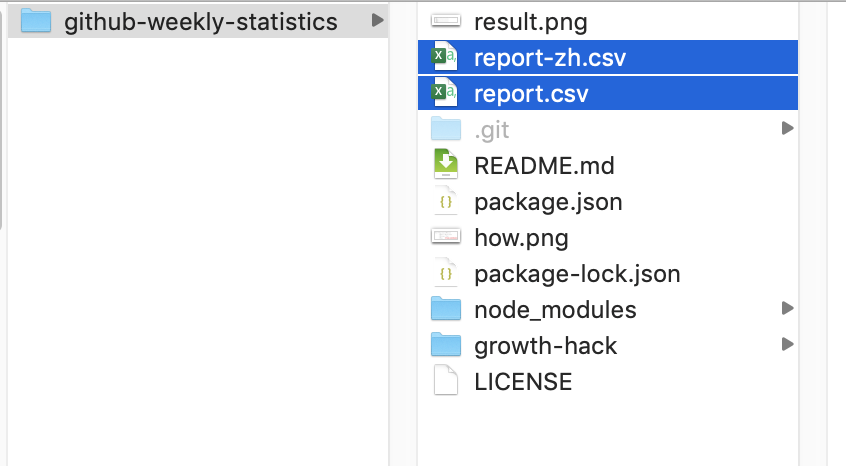

# github-weekly-statistics

A tool to help you do github weekly statistics.

It can:
- generate a weekly report for the github projects you care about 
- calculate an "activity score" for every project 
- use the scores to rank these projects

Screenshots of the reports:


## Usage

### Generate Weekly Report as Excel
0. clone the repo
```bash
git clone https://github.com/seeflood/github-weekly-statistics.git
```

1. Modify the configuration items in `growth-hack/index.js` as you like

```javascript
// Modify these configuration items as you like
// 1. (Optional) Your github API token
// It's not required unless your repositries are private
const token = ``;

// 2. Since when?
// modify it as you like
// e.g.
// let since = `2021-06-12T00:32:13Z`;
let since = utils.lastSaturday();

// 3. Which repositries do you care about?
// Parameters in the repos array are:
// owner, repo, new_stars, new_contributors, new_forks
// Currently the 'new_stars','new_contributors' and 'new_forks' have to be manually counted and put into the code.
let repos = [
  ["mosn", "mosn", 13, 0, 1],
  ["sofastack", "sofa-jraft", 5, 1, 3],
```

2. Run it

```bash
# install packages
npm install
npm run week
```

3. Now you have the weekly report for your repositories!

Check the generated .csv files:

You can open them with Excel:

### Generate Weekly Report as Grafana Dashboard
To generate a Grafana Dashboard,you have to load the `report.csv` data into a MYSQL table and start a Grafana server integrated with the MYSQL table.

1. Create a MYSQL Table

```SQL
CREATE TABLE `github_repo_weekly` (
  `id` int(11) unsigned NOT NULL AUTO_INCREMENT,
  `date_from` datetime DEFAULT NULL,
  `date_to` datetime DEFAULT NULL,
  `record_date` datetime DEFAULT NULL,
  `rank` int(11) NOT NULL,
  `score` int(11) DEFAULT NULL,
  `owner` varchar(40) DEFAULT NULL,
  `project` varchar(100) DEFAULT NULL,
  `new_stars` int(11) DEFAULT NULL,
  `new_contributors` int(11) DEFAULT NULL,
  `new_forks` int(11) DEFAULT NULL,
  `new_pr` int(11) DEFAULT NULL,
  `closed_pr` int(11) DEFAULT NULL,
  `new_issues` int(11) DEFAULT NULL,
  `closed_issues` int(11) DEFAULT NULL,
  `pr_comment` int(11) DEFAULT NULL,
  `issue_comment` int(11) DEFAULT NULL,
  PRIMARY KEY (`id`)
) ENGINE=InnoDB DEFAULT CHARSET=utf8 AVG_ROW_LENGTH=150 ROW_FORMAT=DYNAMIC COMMENT='github_repo_weekly'
;

```

2. Run a Grafana server and add the MYSQL Table as a new datasource.


3. Set up your Grafana dashboard using the config file [grafana/dashboard.json](grafana/dashboard.json)

4. Run our script to generate Excel reports(see above).

5. Load the generated `report.csv` into the MYSQL table.
You can use any tool you like to finish this step.
Since I deploy MYSQL in alibaba cloud,I use the [DMS Console provided by alibaba cloud](https://dms.aliyun.com/) to load the csv data.

6. Open your Grafana Dashboard:


### Generate "Monthly Active Contributors(MAC)"  report as Excel

```bash
npm run month
```
## Rationale
### How is the 'score' calculated?

Based on the [formula](http://oss.x-lab.info/github-insight-report-2020.pdf) proposed by [open-digger](https://github.com/X-lab2017/open-digger),but I add a new factor "new_contributors"


## TODO

1. Currently the 'new_stars','new_contributors' and 'new_forks' have to be manually counted and put into the code(you can get these diff data from https://vesoft-inc.github.io/github-statistics/ ).I will automate it in the future.

The design of github open-API is so bad that you can't get the diff data of 'star','contributor' and 'fork' easily.

2. Currently the `pr_comment` number does not include the pr reviews,again due to the shitty github API